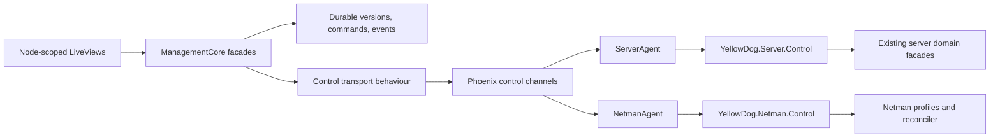

# Service-Node-Scoped Remote Management Design

Date: 2026-07-15

Status: Approved for implementation

## Decision Summary

The YellowDog console will manage concrete `yellow_dog_server` and
`yellow_dog_netman` instances through node-scoped routes and typed remote
operations.

The Server and Netman sections remain visible so an operator can select a
registered instance. Their service navigation and actions remain disabled until
the matching instance is selected. Once selected, every read and write is
scoped to that concrete server or Netman ID.

This design intentionally expands beyond the original foundation PR. It
implements the control channel, durable delivery, runtime activation, rollback,
and remote administration for all mutable Server and Netman console pages in a
single PR. It supersedes the PRD non-goals that deferred full sync and full UI
work, but it does not relax the protocol, storage, or naming guardrails below.

## Hard Guardrails

- Keep exactly three primary runtimes:
  `yellow_dog_management_core`, `yellow_dog_server`, and `yellow_dog_netman`.
- Do not define `YellowDog.Domain.Node`, `YellowDog.Management.Node`,
  `YellowDog.Node`, or another generic Node aggregate, role, or profile.
- Do not create `yellow_dog_cloud_dns` or `yellow_dog_local_server`.
- Keep Server and Netman identities, registries, channels, and control facades
  concrete and separate.
- Do not change DNS, DHCP, mDNS, or Netboot packet parsing or handling.
- Do not add raw `:gen_udp` use.
- Do not add database or Mnesia migrations.
- Do not make `yellow_dog_netman` or `yellow_dog_netman_agent` depend on
  `yellow_dog_store`.
- Do not call Concord directly from server applications.
- Keep VPN as configuration state only.
- Keep the management release independent of runtime service applications.

## Goals

1. Select a registered Server or Netman before entering its service pages.
2. Scope every route, read, mutation, event, and cached snapshot to that ID.
3. Support live query and command delivery over authenticated outbound agent
   connections.
4. Queue durable desired configuration for offline instances and deliver the
   latest desired version on reconnect.
5. Mark configuration applied only after runtime validation, atomic
   persistence, activation or reconciliation, and acknowledgement.
6. Automatically restore and reactivate the previous known-good version when
   activation fails.
7. Expose typed remote contracts for all mutable Server and Netman pages.
8. Build and exercise the three Linux amd64 releases in PR and manual E2E CI.

## Architecture



### `yellow_dog_management_core`

Management core owns durable management state and the console-facing APIs:

- concrete Server and Netman registrations;
- desired, delivered, applying, applied, and failed config versions;
- command and query request state;
- last observed snapshots;
- scoped status and audit events;
- a transport behaviour used to reach the connected runtime.

Management core does not depend on Phoenix, runtime service applications,
Store, Concord, or Mnesia. The console supplies the transport implementation at
runtime.

### `yellow_dog_sync`

The shared sync application contains transport contracts only:

- protocol envelope and version negotiation;
- separate Server and Netman identity envelopes;
- heartbeat, status, query, command, result, config delivery, and apply-result
  envelopes;
- typed Server and Netman operation schemas and codecs;
- digest and bounded-input validation;
- blob references for large payloads.

It contains no persistence, runtime business logic, generic Node model, or
generic arbitrary-RPC escape hatch.

### `yellow_dog_console`

The console owns the Phoenix sockets, concrete connection registries, and the
transport adapter:

- `ServerSocket`, `ServerChannel`, and `ServerConnections`;
- `NetmanSocket`, `NetmanChannel`, and `NetmanConnections`;
- correlated request delivery and result routing;
- authenticated blob download for large assets;
- PubSub broadcasts scoped by concrete type and ID.

LiveViews call management-core facades. They do not call runtime modules,
processes, ETS tables, Store, Mnesia, or local files.

### Runtime Agents

Both agents initiate outbound TLS WebSocket connections to management core.
Each agent owns:

- reconnect with bounded exponential backoff;
- heartbeat and capability reporting;
- a durable local command journal;
- config staging and digest verification;
- typed operation dispatch;
- current and previous config manifests;
- activation reporting and rollback.

`YellowDog.ServerAgent` dispatches through `YellowDog.Server.Control`.
`YellowDog.NetmanAgent` dispatches through `YellowDog.Netman.Control`.
The target runtime remains the sole writer of its Store, Mnesia, TOML, and
filesystem state.

## Navigation And Route Scope

Selection landing routes remain available without a selection:

```text
/server
/netman
```

All service routes carry a concrete identifier:

```text
/server/:server_id/dashboard
/server/:server_id/settings/...
/server/:server_id/dns/...
/server/:server_id/dhcpv4/...
/server/:server_id/dhcpv6/...
/server/:server_id/mdns/...
/server/:server_id/netboot/...
/server/:server_id/identity/...

/netman/:netman_id
/netman/:netman_id/config
/netman/:netman_id/interfaces
/netman/:netman_id/resolved
/netman/:netman_id/dhcp-client
```

The Server and Netman selectors list registered management records, including
offline instances, and show name, profile, and status. The selector remains
enabled before selection. Service navigation is rendered as a disabled control
without an `href`, with `disabled` or `aria-disabled="true"`, until selection.

A shared route-scope helper preserves the selected ID through navbar and
sidebar links, nested edit routes, forms, back links, redirects, and
`push_navigate` calls. Management tables also link directly to the scoped
section for a concrete record.

Legacy unscoped routes redirect to the matching selection landing page. They
never choose a default instance. Unknown IDs render a deterministic not-found
state and never fall back to another record.

Registered offline instances remain selected. Their pages show timestamped
cached snapshots. Durable configuration changes may be published for later
delivery. Imperative operations are disabled while offline and are never
queued.

The management-release-only plug permits the scoped Server and Netman routes.
Those pages are safe in that release because all data passes through management
facades instead of local runtime dependencies.

## Transport Protocol

Every message has a versioned envelope containing:

```text
protocol_version
request_id
target_type
target_id
operation
expected_revision
idempotency_key
payload
payload_digest
sent_at
```

`target_type` is strictly `server` or `netman`. The decoder uses an allowlist to
map operation names to typed schemas. Unknown operations, malformed IDs,
oversized payloads, invalid digests, and unsupported protocol versions are
rejected before runtime dispatch.

Queries and imperative commands require an online connection. Commands carry
an expected resource revision and an idempotency key. Agents persist completed
results by request ID. A duplicate request returns the recorded result without
repeating the mutation.

If a connection is lost after command delivery, management records the outcome
as `unknown`, not success or failure. On reconnect, the agent reports its
command journal so management can resolve the result.

Only one active connection is accepted for a concrete Server or Netman ID. A
new authenticated connection completes its status handshake before replacing
the old connection.

## Configuration Delivery And Rollback

The durable lifecycle is:

```text
desired -> delivered -> applying -> applied
                |            |
                |            +-> failed with rollback result
                +--------------> failed
```

1. Management validates the envelope, atomically stores an immutable version,
   and advances the target's desired-version pointer.
2. If the target is connected, management delivers it immediately. If offline,
   the desired pointer acts as a durable queue.
3. On reconnect, management delivers only the latest desired version. Older
   immutable versions remain available for audit and rollback.
4. The agent verifies the digest and durably stages the exact payload before
   acknowledging `delivered`.
5. The agent validates with the target runtime's canonical validators, records
   the previous applied version, and reports `applying`.
6. It performs same-directory atomic file replacement and activates or
   reconciles the runtime.
7. Success advances the local and management applied pointers.
8. Failure restores and reactivates the previous known-good version. The new
   version remains `failed` and records whether rollback succeeded, the restored
   version, the failure phase, and a bounded reason.

For connectivity-changing Netman updates, activation is provisional until the
agent reconnects within a configured rollback window. If it cannot reconnect,
it restores the previous profile autonomously.

## Durable Storage

Management uses file-backed storage under its configured data directory:

```text
management/
  servers/<id>/manifest.json
  servers/<id>/versions/<version>-<digest>.json
  netmans/<id>/manifest.json
  netmans/<id>/versions/<version>-<digest>.json
  commands/<request_id>.json
  events/<event_id>.json
  snapshots/servers/<id>/<domain>.json
  snapshots/netmans/<id>/<domain>.json
  blobs/<sha256>
```

IDs are validated before path construction. Immutable files are created once.
Mutable manifests are written to a temporary file in the destination directory,
synced with `:file.sync/1`, closed, and renamed. A crash can leave an
unreferenced immutable file, but never a partially referenced version.

Agents use the same immutable-version and atomic-manifest pattern for their
local command journals and config history. No Ecto Repo, database migration,
Concord dependency, or Mnesia schema is introduced.

## Authentication And Limits

Production control sockets require TLS and a deployment-level
`YELLOW_DOG_MANAGEMENT_TOKEN`. The socket compares the token in constant time.
The first implementation intentionally defers per-instance enrollment and
certificates.

The protocol enforces bounded lengths for IDs, operation names, error messages,
list sizes, command journals, snapshots, and payloads. Large Netboot assets are
stored by SHA-256 digest and fetched through an authenticated endpoint. Channel
messages carry only blob metadata and the expected digest.

The shared token is a known first-version limitation: possession permits a
runtime to claim a registered ID. Per-instance enrollment and mTLS remain a
follow-up and do not alter the concrete Server/Netman domain model.

## Typed Domain Operations

### Server

| Domain | Node-scoped reads | Typed mutations |
| --- | --- | --- |
| Runtime | capabilities, services, health, stats | start, stop, restart service |
| DNS | views, zones, records, ACLs, providers, logs, metrics | view, zone, record, ACL, and provider CRUD; import; sync; conflict resolution |
| DHCPv4/v6 | pools, leases, activity, status | pool CRUD, force delete, lease release |
| mDNS | services, discovery, monitor, cache | register, update, delete, toggle service; clear cache |
| Netboot | profiles, devices, assets, transfers, logs | profile and device mutations; asset upload, delete, and rescan |
| Identity | hosts, approvals, tokens, policies, audit | host approval, revoke, delete; token create and revoke; policy update |
| Settings | effective config, source, revision, validation | update, apply, reload, rollback by service |

### Netman

| Domain | Node-scoped reads | Typed mutations |
| --- | --- | --- |
| Runtime | capabilities, apply mode, reconciliation health | none |
| Profiles | profile list, active revision, history | validate, put, delete, activate, rollback |
| Interfaces/routes | links, addresses, routes, connection state | profile patch, activate or deactivate connection |
| Resolved | upstreams, search domains, cache, counters | update or rollback config, flush cache |
| DHCP client | FSM and lease state | release lease through the owning connection |
| VPN | resolved profile state | no tunnel operation |

Each mutable resource exposes a revision or digest. A stale expected revision
returns a conflict instead of overwriting newer state. Runtime validation is
authoritative. Bulk operations return an explicit result for every requested
item instead of replaying LiveView loops remotely.

The runtime control facades hide PIDs, ETS tables, Store records, protocol
structs, and local file paths. They adapt typed commands to existing domain
facades. Existing multi-step mutations must either complete atomically or
restore the prior local value before reporting failure.

Netman profile persistence and Netboot profile persistence become durable in
this PR. An operation cannot be reported applied if it would disappear after a
runtime restart. Netman changes flow through its profile and reconciliation
engine; remote code does not call kernel managers directly.

## Snapshots And Events

Online reads use correlated queries. Successful results are stored as scoped,
timestamped snapshots with a resource revision. Agents also push status and
event envelopes using topics scoped by concrete type and ID.

When offline, pages may render the latest snapshot but must display its
observation time and offline state. Cached data never enables an imperative
action. Empty or absent snapshots render an unavailable state rather than local
runtime data.

## Stable Errors

The control protocol exposes stable error codes:

```text
not_connected
not_found
invalid
conflict
unsupported
timeout
apply_failed
rollback_failed
internal
```

Errors include a bounded human-readable message and structured field details
where applicable. Internal exceptions and paths are logged at the runtime but
are not sent to the browser.

## Supervision And Release Wiring

- The management release starts management durable stores, the console
  endpoint, Server connections, and Netman connections.
- The Server release starts `yellow_dog_server_agent` permanently after the
  Server runtime is available.
- The Netman release starts `yellow_dog_netman_agent` permanently after Netman
  is available.
- Agents are disabled by default in tests unless a test enables a local
  management URL and token.
- The combined development release may keep both agents for compatibility.
- `yellow_dog_server_agent` and `yellow_dog_netman_agent` depend on
  `yellow_dog_sync` and the socket client, but not on each other's runtimes.
- Runtime adapters are configured modules, avoiding dependency cycles between
  an agent and its runtime application.

## Console Migration

All existing `/server` and `/netman` LiveViews move behind management facade
modules before their direct local calls are removed. A shared scope hook parses
and validates route IDs and assigns the selected concrete record. A shared route
helper constructs every nested path.

The migration preserves the current visible top-menu order and existing
DuskMoon components. It does not override design tokens or introduce a broad UI
rewrite. The selector, offline banner, not-found state, disabled navigation,
loading state, conflict state, and command-result feedback are feature-complete
for the new workflow.

## Testing Strategy

### Unit And Integration Tests

- `yellow_dog_sync`: codecs, allowlists, bounds, digest checks, correlation,
  protocol negotiation, and atom safety.
- `yellow_dog_management_core`: restart durability, atomic writes, latest
  desired delivery, lifecycle transitions, command reconciliation, snapshots,
  and events.
- Server and Netman agents: authentication, reconnect, duplicate delivery,
  journals, successful activation, failed activation, automatic rollback, and
  Netman reconnect-timeout rollback.
- Runtime control facades: every typed query and command, stale revisions,
  unsupported capabilities, validation failures, and bulk results.
- Phoenix channels: token rejection, concrete identity isolation, one active
  connection, request correlation, timeout, reconnect, and stale results.
- LiveViews: disabled menus before selection, scoped routes, ID preservation,
  offline snapshots, unknown IDs, conflicts, and proof that each mutation
  targets only the selected runtime.

Tests are written and observed failing before each production behavior is added.

### Release E2E

The E2E workflow runs on `pull_request` and `workflow_dispatch` and builds the
host-native Linux amd64 releases for:

```text
yellow_dog_management_core
yellow_dog_server
yellow_dog_netman
```

It starts management core with temporary durable storage, starts Server and
Netman with safe nonprivileged or mock E2E settings, and verifies:

1. both runtimes authenticate, register, and appear in the console;
2. scoped Server and Netman reads return the selected runtime's data;
3. representative typed mutations from every domain return correlated results;
4. online configuration reaches `applied` only after activation;
5. an offline desired version is delivered after restart;
6. duplicate delivery is idempotent;
7. invalid activation restores the previous known-good version;
8. Netman connectivity loss triggers its rollback window;
9. management-core restart preserves registrations, versions, commands, and
   events.

Cross-architecture release artifact builds remain separate. Runtime E2E uses
host-native amd64 binaries.

## Final Verification

Run at minimum:

```text
mix format --check-formatted
mix compile --warnings-as-errors
mix test
cd apps/yellow_dog_console && mix test
cd apps/yellow_dog_console && mix assets.build
mix test.e2e.management
```

Run repository guardrails that verify:

- no forbidden Node modules or cloud/local apps exist;
- no new raw `:gen_udp` use exists;
- no protocol parser or packet-handler files changed;
- Netman and NetmanAgent have no Store dependency;
- no Mnesia schema or database migration changed;
- all three releases build and complete the management E2E flow.

## Acceptance Criteria

- Server and Netman service navigation is disabled without selection.
- Every enabled route and action contains the selected concrete ID.
- Every mutable Server and Netman page reads and writes through typed remote
  management facades.
- The management release does not start runtime service applications.
- Offline desired configuration survives management restart and applies on
  reconnect.
- Applied status means validation, durable write, runtime activation, and
  acknowledgement all succeeded.
- Failed activation restores the previous known-good version and reports the
  rollback outcome.
- Imperative offline operations are rejected and never queued.
- Release E2E runs for management core, Server, and Netman on PRs and manual
  dispatch.
- Existing dirty user changes are preserved and integrated without being
  reverted.
- All architecture guardrails remain satisfied.

## Deferred Work

The following remain separate follow-ups:

- per-instance enrollment, certificates, and mTLS identity;
- replicated or highly available management persistence;
- VPN tunnel implementation;
- cross-architecture runtime E2E execution;
- retention and compaction policies beyond bounded first-version defaults.
